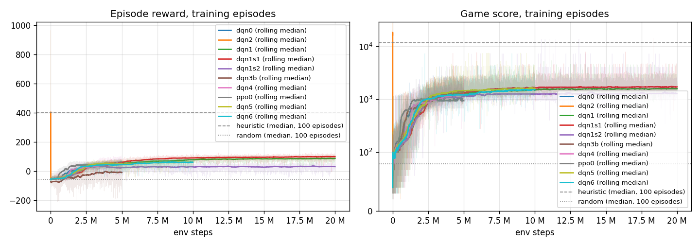
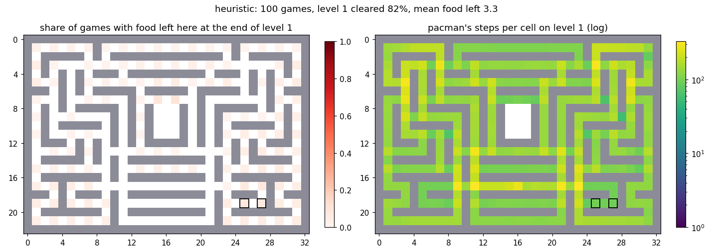
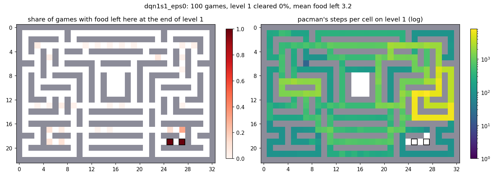
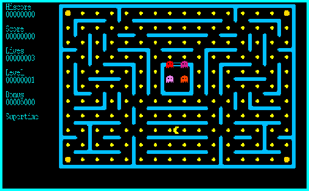

# pacman-rl

Reinforcement learning on the **original pacman 1.0** (1995, Roar Thronaes,
GPL-2+), the X11 game from the Debian package `pacman` (version 10-21). The
game is not reimplemented: its C++ sources are compiled with a small bridge
and driven as a gymnasium environment through a Unix socket.

> Draft (2026-10-07). Numbers are taken from `docs/results.md`; where there
> is no measured number yet, the text says TODO.



## How the game became an environment

- `game/` holds the unmodified sources (first commit) plus minimal patches,
  each marked `// RL bridge`. Windows (`MSWIN`) branches are untouched.
  Changes to the original files: 63 added and 4 removed lines in 10 files
  (most of them argument parsing in `arg.cc`), plus the new
  `game/rlbridge.cc/.h` (157 lines).
- `--rl <socket>`: the game connects to a Unix socket, sends one JSON state
  per tick (board 23 x 33, pacman, ghosts, bonus, score, lives, level,
  supertime) and blocks for one action line (`U/D/L/R/N`).
- `--fast`: no sleeping between ticks. `--headless` (with `--rl`): no X11 at
  all; a test checks that the state stream is byte-identical to the X11 mode.
  `--seed N`: deterministic games. `--no-ghosts`: ghosts stay in their house
  (diagnostics only).
- Throughput: TODO (single env headless, `scripts/bench_env.py`; the
  measurement from 2026-10-05 is in the git log only, not yet in
  `docs/results.md`).
- `env/pacman_env.py`: `Pacman1995-v0`, a gymnasium env that starts the game
  (headless by default, or in a window with `display=":0"`) and serves the
  socket.

## Install and run

```bash
sudo apt install xutils-dev libx11-dev libncurses-dev   # xmkmf, X11 headers, curses
cd game && xmkmf && make && cd ..
python3 -m venv .venv && .venv/bin/pip install -e ".[dev]"
.venv/bin/python -m pytest
```

The dependency versions in `pyproject.toml` are the tested ones; torch was
installed as the CUDA 13.0 build (`2.14.1+cu130`) from the PyTorch index.

```bash
# watch an agent in the game window (real time), optionally record a GIF
.venv/bin/python scripts/play.py --agent heuristic --seed 0 --display :0
.venv/bin/python scripts/play.py --agent dqn --checkpoint runs/dqn1s1/best_food.pt \
    --display :0 --record docs/agent.gif --max-steps 400

# train (long runs belong in tmux) and evaluate
.venv/bin/python scripts/train.py --config configs/dqn_long.yaml --seed 1 --run-name dqn1s1
.venv/bin/python scripts/evaluate.py --agent dqn --checkpoint runs/dqn1s1/best_food.pt --episodes 100
```

All hyperparameters live in `configs/*.yaml`. `scripts/supervisor.py` watches
runs (evaluations every 500k steps, one restart after a crash),
`scripts/final_eval.py` does the final 100-game evaluations.

## Observation and reward

The observation is a `Dict`: 21 binary/count planes over the 23 x 33 board
(walls, gate, dots, energizers, pacman and its direction, last requested
direction, ghosts by state and direction, bonus) and a small vector (lives,
supertime, level); optional extra parts (a food-distance plane, steps since
the last food). Details: [docs/observation.md](docs/observation.md).

The reward counts events, not the game score: dot +1, energizer +2, ghost +5,
level +50, death -20, step -0.02. The game score has a hole: the ghost score
doubles with every ghost eaten and the counter only resets when pacman stops
being super, while eaten ghosts revive during super mode. The heuristic
scored 102400 points for a single ghost once (`docs/results.md`, Notes). A
reward based on the score would mostly teach ghost chains.

## Results

Final evaluation: 100 games, seeds 0..99, greedy (eps 0), no shaping; food =
dots + energizers eaten per game, 172 on level 1. From `docs/results.md`
("Summary of all runs"):

| agent / run | checkpoint | mean food | level 1 cleared | mean reward | median score |
|---|---|---|---|---|---|
| random | - | - | 0% | -53.4 | 80 |
| heuristic (BFS, `agents/heuristic_agent.py`) | - | - | 82% | 465.5 | 11825 |
| dqn0, baseline DQN, 5M steps | best.pt | 128.3 | 0% | 61.9 | 1360 |
| dqn1, 20M steps, 3 seeds (mean +- std) | best_food.pt | 140.6 +- 28.5 | 0% | 23.4 +- 37.4 | 1668 +- 157 |
| dqn1 seed 1 (best single run) | best_food.pt | 168.8 | 0% | 56.1 | 1855 |
| dqn1 seed 1, eps 0.05 | best_food.pt | 159.4 | 0% | 99.0 | - |
| dqn7 / dqn8, endgame fine-tunes of dqn1 seed 1 | best_food.pt | TODO | TODO | TODO | TODO |

Training curves: `docs/training.png`; evaluation curves: `docs/eval.png`.

Where level 1 is left unfinished (100 games each): dqn1 seed 1 never enters
the bottom-right side loop and leaves its two dots in every game; seeds 0 and
2 have never-visited regions elsewhere; the heuristic eats them.

| heuristic | dqn1 seed 1, eps 0 |
|---|---|
|  |  |

dqn1 seed 1 (best_food.pt, greedy), the first 400 ticks of seed 0 in real
time (`scripts/play.py --record`, Xvfb):



## What worked, what did not

Worked:
- Longer training of the plain DQN (dqn1, 20M steps): the best seed eats
  168.8 of 172 food items per game.
- A little randomness at evaluation (eps 0.05): no game stuck until the step
  limit, the best mean reward (99.0 for dqn1 seed 1).
- Choosing checkpoints by food eaten instead of mean reward, and by mean
  instead of median (a median hides games stuck until the step limit).

Did not work (each one seed unless noted, `docs/results.md`):
- Heuristic warm start of the replay buffer (dqn2): same at 5M, slower at 1M.
- Potential-based distance shaping (dqn3b), hunger limit (dqn4), PPO (ppo0).
- A food-distance plane and steps-since-food (dqn5), plus 5-step returns and
  gamma 0.995 (dqn6): below plain dqn1 at the same step count.
- Endgame curriculum and endgame dot reward (dqn7, dqn8): TODO.

No agent has cleared level 1 (TODO: unless dqn7/dqn8 do). Seeds differ more
than any change tried: the same dqn1 config gives 101.5 to 168.8 food.

## Known problem: a fixed point of the greedy policy

Greedy agents stop and stand still, often next to food. Without ghosts
(`--no-ghosts`, `configs/env_noghosts.yaml`) every DQN stops for good after
some dozens of food items and stays until the step limit: when pacman stands
the observation does not change, so the same action is chosen again. With
ghosts their movement usually breaks the loop; eps 0.05 at evaluation
removes the stuck games (`docs/results.md`, Diagnostics).

## Future work

From "Ideas for later" in `docs/overnight.md`:
- at least 3 seeds per config: the seed spread is larger than the effects;
- a little randomness as part of the policy, or sampling when the
  observation repeats;
- a reward that values the last dots more (TODO: see dqn8);
- separate the effects of the dqn5 observation parts and of the shorter
  epsilon schedule;
- a separate seed range for checkpoint selection.

## Repository

```
game/      pacman 1.0 sources + RL bridge (C++, X11)
env/       PacmanEnv (gymnasium), Pacman1995-v0
agents/    random, BFS heuristic, DQN (double, dueling, n-step, PER), PPO
scripts/   train, train_ppo, evaluate, final_eval, supervisor, play, plots, diagnostics
tools/     socket demo client, endgame prefix recorder
configs/   all hyperparameters (env, agents, runs)
data/      recorded endgame prefixes
docs/      results, observation, session logs, plots
tests/     pytest
```

## License and authorship

The game is pacman 1.0 (c) 1995 Roar Thronaes, GPL-2+ (`game/COPYING`,
`game/Copyright`, from the Debian package `pacman` 10-21). This repository is
distributed under the GPL-2.0-or-later as well (`LICENSE`).
RL bridge, environment and agents: ace8ecar-source (TODO: author name as it
should appear), written with Claude Code.
