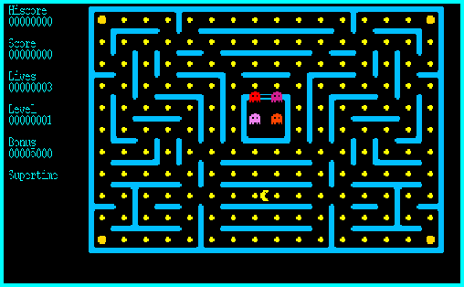
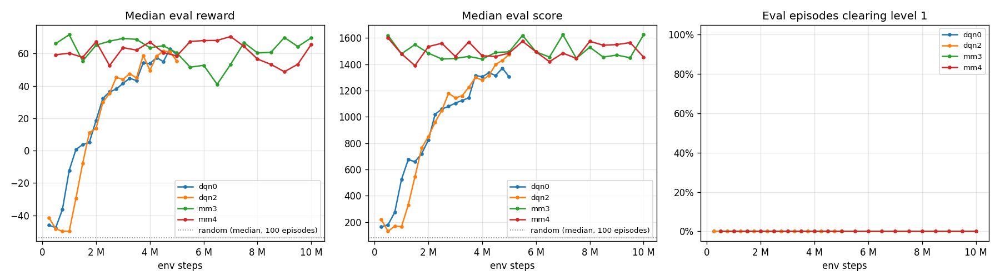
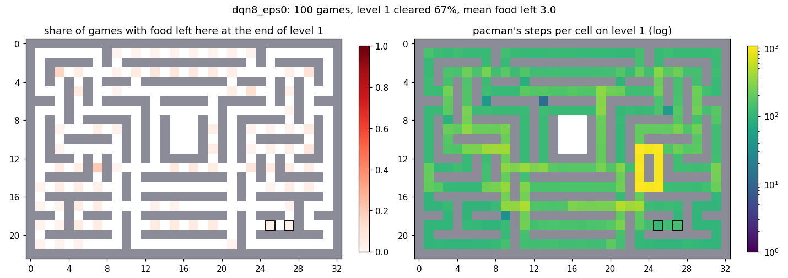

# pacman-1995-rl

Reinforcement learning on the **original pacman 1.0** (1995, Roar Thronaes,
GPL-2+), the X11 game from the Debian package `pacman` (version 10-21). The
game is not reimplemented: its C++ sources are compiled with a small bridge
and driven as a gymnasium environment through a Unix socket. The main lesson
about generalization: the agents learn a route through one maze, and the game
has 16 different mazes, so the best agent, which clears level 1, stalls on
level 2, whose maze differs from level 1 in 23 cells.



> v0.1 (2026-10-07): the first agent that clears level 1 (dqn8, 67% of
> greedy games). Numbers are taken from `docs/results.md` and the session
> logs `docs/overnight.md`.

## How the game became an environment

- `game/` holds the unmodified sources (first commit) plus minimal patches,
  each marked `// RL bridge`. Windows (`MSWIN`) branches are untouched.
  Changes to the original files: 63 added and 4 removed lines in 10 files
  (most of them argument parsing in `arg.cc`), plus the new
  `game/rlbridge.cc/.h` (157 lines).
- `--rl <socket>`: the game connects to a Unix socket, sends one JSON state
  per tick (board 23 x 33, pacman, ghosts, bonus, score, lives, level,
  supertime) and blocks for one action line (`U/D/L/R/N`).
- `--fast`: no sleeping between ticks. `--headless` (with `--rl`): no X11 at
  all; a test checks that the state stream is byte-identical to the X11 mode.
  `--seed N`: deterministic games. `--no-ghosts`: ghosts stay in their house
  (diagnostics only).
- Throughput: a single headless env runs at about 32k steps/s with random
  actions (`scripts/bench_env.py`, 2026-10-07, `docs/results.md`); DQN
  training with 4 envs ran at 1.8-3.5k env steps/s (median 2.6k, dqn0,
  `docs/results.md`).
- `env/pacman_env.py`: `Pacman1995-v0`, a gymnasium env that starts the game
  (headless by default, or in a window with `display=":0"`) and serves the
  socket.

## Install and run

Requirements: Linux with X11 libraries, Python 3.10+. A GPU is optional: on
CPU evaluation and play work the same and training is slower (about 435 env
steps/s in a short check with the GPU hidden, against 1.8-3.5k with an
RTX 4060 laptop GPU).

```bash
git clone https://github.com/AceEca-robo/pacman-1995-rl.git && cd pacman-1995-rl
sudo apt install build-essential xutils-dev libx11-dev libncurses-dev   # g++, xmkmf, X11, curses
sudo apt install xvfb xdotool x11-apps   # tests on a virtual display, play.py --record (xwd)
cd game && xmkmf && make && cd ..
python3 -m venv .venv && .venv/bin/pip install -e ".[dev]"
.venv/bin/python -m pytest
```

The dependency versions in `pyproject.toml` are the tested ones; torch was
installed as the CUDA 13.0 build (`2.14.1+cu130`) from the PyTorch index.

```bash
# watch an agent in the game window (real time), optionally record a GIF
.venv/bin/python scripts/play.py --agent heuristic --seed 0 --display :0
.venv/bin/python scripts/play.py --agent dqn --checkpoint runs/dqn1s1/best_food.pt \
    --display :0 --record docs/agent.gif --max-steps 400

# train (long runs belong in tmux) and evaluate
.venv/bin/python scripts/train.py --config configs/dqn_long.yaml --seed 1 --run-name dqn1s1
.venv/bin/python scripts/evaluate.py --agent dqn --checkpoint runs/dqn1s1/best_food.pt --episodes 100
```

Trained checkpoints are not in the repository (`runs/` is ignored); the two
from this release are attached to the GitHub release
[v0.1](https://github.com/AceEca-robo/pacman-1995-rl/releases/tag/v0.1):
`dqn8_best_food.pt` (clears level 1 in 67% of greedy games) and
`dqn1s1_best_food.pt` (its starting point). Put them anywhere and pass the
path with `--checkpoint`.

All hyperparameters live in `configs/*.yaml`. `scripts/supervisor.py` watches
runs (evaluations every 500k steps, one restart after a crash),
`scripts/final_eval.py` does the final 100-game evaluations.

## Observation and reward

The observation is a `Dict`: 21 binary/count planes over the 23 x 33 board
(walls, gate, dots, energizers, pacman and its direction, last requested
direction, ghosts by state and direction, bonus) and a small vector (lives,
supertime, level); optional extra parts (a food-distance plane, steps since
the last food). Details: [docs/observation.md](docs/observation.md).

The reward counts events, not the game score: dot +1, energizer +2, ghost +5,
level +50, death -20, step -0.02. The game score has a hole: the ghost score
doubles with every ghost eaten and the counter only resets when pacman stops
being super, while eaten ghosts revive during super mode. The heuristic
scored 102400 points for a single ghost once (`docs/results.md`, Notes). A
reward based on the score would mostly teach ghost chains.

## Results

Final evaluation: 100 games, seeds 0..99, greedy (eps 0), no shaping; food =
dots + energizers eaten per game, 172 on level 1. From `docs/results.md`
("Summary of all runs"):

| agent / run | checkpoint | mean food | level 1 cleared | mean reward | median score |
|---|---|---|---|---|---|
| random | - | - | 0% | -53.4 | 80 |
| heuristic (BFS, `agents/heuristic_agent.py`) | - | - | 82% | 465.5 | 11825 |
| dqn0, baseline DQN, 5M steps | best.pt | 128.3 | 0% | 61.9 | 1360 |
| dqn1, 20M steps, 3 seeds (mean +- std) | best_food.pt | 140.6 +- 28.5 | 0% | 23.4 +- 37.4 | 1668 +- 157 |
| dqn1 seed 1 (best single run) | best_food.pt | 168.8 | 0% | 56.1 | 1855 |
| dqn1 seed 1, eps 0.05 | best_food.pt | 159.4 | 0% | 99.0 | - |
| dqn7: dqn1 seed 1 fine-tuned on endgame prefixes, 5M | best_food.pt | 169.4 | 0% | 40.4 | 1760 |
| **dqn8: dqn7 + endgame dot reward** | best_food.pt | **246.2** | **67%** | **214.8** | **5030** |
| dqn8, eps 0.05 | best_food.pt | 159.5 | 4% | 102.4 | - |
| dqn8 setup from dqn1 seed 0 / seed 2 | best_food.pt | 153.9 / 103.2 | 0% / 0% | 67.1 / -40.8 | 1680 / 1395 |
| dqn8 setup, 3 starting networks (mean +- std) | best_food.pt | 167.8 +- 59.2 | 22% (67 / 0 / 0) | 80.4 +- 104.8 | 2702 +- 1651 |

Training curves (`docs/training.png`) and evaluation curves
(`docs/eval.png`); the fine-tunes dqn7, dqn8, dqn8s0, dqn8s2 are plotted from
their own step 0, they start from networks trained for 17.5-19.5M steps:




Where level 1 is left unfinished (`scripts/diag_endgame.py`, 100 games each):
dqn1 seed 1 never enters the bottom-right side loop and leaves its two dots
in every game; seeds 0 and 2 have never-visited regions of their own
elsewhere; the heuristic eats all of them. After the endgame fine-tune
(dqn8) the loop is eaten and no cell is left in every game; the same
fine-tune from seeds 0 and 2 leaves their regions untouched.

| heuristic | dqn1 seed 1, eps 0 | dqn8, eps 0 |
|---|---|---|
|  |  |  |

The GIF at the top is dqn8 (best_food.pt, greedy), the first 400 ticks of
seed 0 in real time (`scripts/play.py --record`, Xvfb); `docs/dqn1s1.gif`
shows its starting point, dqn1 seed 1.

## What worked, what did not

Worked:
- Longer training of the plain DQN (dqn1, 20M steps): the best seed eats
  168.8 of 172 food items per game.
- A little randomness at evaluation (eps 0.05): no game stuck until the step
  limit, the best mean reward (99.0 for dqn1 seed 1).
- Choosing checkpoints by food eaten instead of mean reward, and by mean
  instead of median (a median hides games stuck until the step limit).
- Clearing level 1 (dqn8): fine-tuning the best DQN with episodes that start
  near the end of level 1 (replayed heuristic openings with <= 15 food left,
  `data/endgame_prefixes.json`, half of the resets) **and** dots worth more
  as the board empties (`1 + 20 / max(food left, 1)`): level 1 cleared in
  67% of 100 greedy games, from 0%.

Did not work (each one seed unless noted, `docs/results.md`):
- Heuristic warm start of the replay buffer (dqn2): same at 5M, slower at 1M.
- Potential-based distance shaping (dqn3b), hunger limit (dqn4), PPO (ppo0).
- A food-distance plane and steps-since-food (dqn5), plus 5-step returns and
  gamma 0.995 (dqn6): below plain dqn1 at the same step count.
- The endgame prefixes alone (dqn7): 169.4 food, level 1 never cleared.
- eps 0.05 with dqn8: level 1 cleared in only 4% of games; the precise
  endgame does not tolerate random moves.
- The same endgame fine-tune from dqn1 seeds 0 and 2 (dqn8s0, dqn8s2):
  level 1 never cleared, food 153.9 and 103.2, their blind regions
  unchanged. Seed 2's region was not in any recorded prefix; seed 0's was in
  11 of 28 and still was not learned.

So level 1 is cleared by one agent (dqn8, 67% of greedy games), not by the
recipe in general: over its three starting networks the mean is 22%. Seeds
differ more than most changes tried (dqn1: 101.5 to 168.8 food).

## Known limitations

**Only level 1 is learned.** Training and evaluation use level 1 only
(evaluation scores and food counts include whatever happens after it, but
nothing was trained for it). The game has 16 different mazes
(`boards[LEVELS][...]` in `game/board.h`, `LEVELS 16` in `game/pac.h`):
level n is played on maze n, and from level 17 on a random one of the 16
(`Gamedata::setboardlevel`, `game/gamedata.cc`). The level 2 maze differs
from level 1 in 23 cells of walls and passages, so a level-1 route does not
carry over. Seen on screen and reproduced (dqn8, seed 0, greedy): it clears
level 1 at step 518 (score 4790), eats 137 of 172 food items on level 2,
stops eating after step 826, loses its remaining lives and the game ends at
step 941 with score 6220 and 35 food items left on level 2.

### A fixed point of the greedy policy

Greedy agents stop and stand still, often next to food. Without ghosts
(`--no-ghosts`, `configs/env_noghosts.yaml`) every DQN stops for good after
some dozens of food items and stays until the step limit: when pacman stands
the observation does not change, so the same action is chosen again. With
ghosts their movement usually breaks the loop; eps 0.05 at evaluation
removes the stuck games (`docs/results.md`, Diagnostics). dqn8 has the same
problem: without ghosts it stops after 32 food items (eps 0).

## Future work

From "Ideas for later" in `docs/overnight.md`:
- endgame prefixes per agent, stopping with its own blind-spot cells still
  full (seed 2's region was in no prefix);
- the endgame dot reward without prefixes, the dqn8 recipe from scratch, and
  several training seeds per starting network;
- a small eps (0.01) or randomness only when the observation repeats: dqn8
  clears the level in 67% of greedy games but 4% with eps 0.05;
- at least 3 seeds per config: the seed spread is larger than most effects;
- separate the effects of the dqn5 observation parts and of the shorter
  epsilon schedule; a separate seed range for checkpoint selection;
- level 2 and later: dqn8 already plays into level 2, nothing measured there.

## Repository

```
game/      pacman 1.0 sources + RL bridge (C++, X11)
env/       PacmanEnv (gymnasium), Pacman1995-v0
agents/    random, BFS heuristic, DQN (double, dueling, n-step, PER), PPO
scripts/   train, train_ppo, evaluate, final_eval, supervisor, play, plots, diagnostics
tools/     socket demo client, endgame prefix recorder
configs/   all hyperparameters (env, agents, runs)
data/      recorded endgame prefixes
docs/      results, observation, session logs, plots
tests/     pytest
```

## License and authorship

The game is pacman 1.0 (c) 1995 Roar Thronaes, GPL-2+ (`game/COPYING`,
`game/Copyright`, from the Debian package `pacman` 10-21). This repository is
distributed under the GPL-2.0-or-later as well (`LICENSE`).
RL bridge, environment and agents: AceEca-robo, written with Claude Code.
